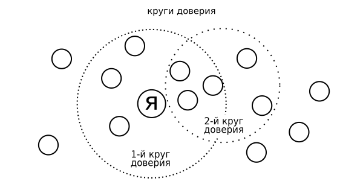
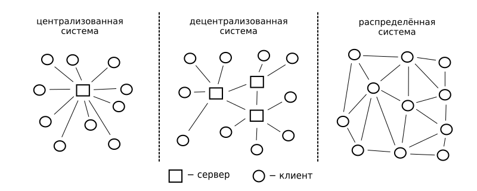
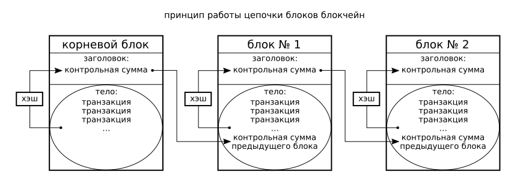
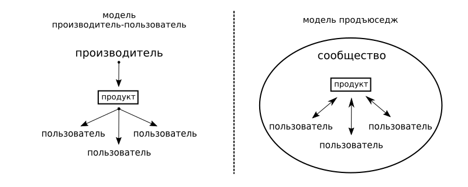
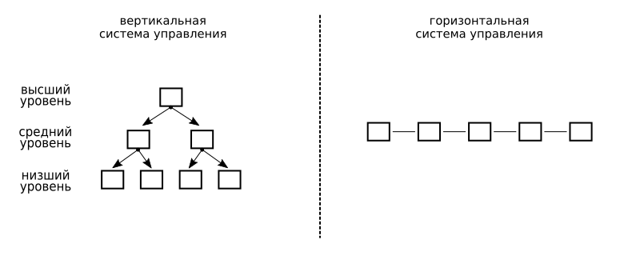

# Государство в эпоху интернет
### Интернет

Появление интернета, а после и интернета в мобильных устройствах, в корне изменило сознание людей. Сегодня уже тяжело представить себе жизнь без всемирной паутины, а жизнь онлайн становится важнее физической реальности, однако, изменения связанные с появлением сети лишь набирают темпы.

Исследователь интернета [Александр Бард](http://chewbakka.com/diplodocus/alexandr_bard) говорит о том, что на заре эпохи интернета, в период [пузыря доткомов](https://ru.wikipedia.org/wiki/Пузырь_доткомов), крупные компании рассчитывали, что интернет будет лишь средством доставки информации, таким же, как телевидение и радио, только более эффективным. В начале оно так и было, но вскоре пользователи начали общаться между собой, начали появляться инициативы снизу, создаваться частные интернет-ресурсы. В итоге оказалось так, что крупные компании перестали играть ключевую роль в жизни сети, а основными производителями информации стали сами пользователи. Так в сети зародился новый тренд − тренд на децентрализацию.

Бизнес отреагировал на изменения быстрее, модное течение породило культ горизонтальной системы управления, который сегодня можно встретить во многих тех-компаниях. Давайте попробуем понять, какие изменения могут произойти в государстве и обществе основываясь на том, что происходит в самой сети и бизнесе.

### Цифровой след

В цифровую эпоху за каждым человеком остаётся так называемый [«цифровой след»](https://ru.wikipedia.org/wiki/Цифровой_след). Цифровой след − это след который оставляет пользователь в сети и во всевозможных устройствах, хранящих персональные данные. Цифровой след может быть активным − публикации в социальных сетях и форумах, загруженные фотографии и видео, и пассивным − метрики, метаданные, информация о посещённых сайтах, данные с датчиков мобильных устройств.

По поводу активного следа всё относительно ясно  − это всё, что человек делает в сети, пассивный же след не такой явный, поэтому остановимся на нём подробнее. К примеру, когда вы переходите с одного веб-сайта на другой, если на обоих сайтах присутствует реклама одного и того же поставщика, то поставщик рекламы имеет возможность отслеживать пути ваших переходов. Делается это для того, чтобы как можно лучше понять модели вашего поведения и предложить вам рекламу, которая вас заинтересует. Аналогичная ситуация и с приложениями для мобильных устройств, они отслеживают ваше местоположение, чтобы предложить вам контекстную рекламу, привязанную к вашему местоположению.

Совокупность активного и пассивного следа образует громадное количество данных, так называемые [«Большие данные»](https://ru.wikipedia.org/wiki/Большие_данные). Эти данные позволяют составить математическую модель поведения конкретного человека или толпы и предсказывать вероятность той или иной реакции на различные действия, что, в свою очередь, сильно увеличивает эффективность бизнеса.

В конце 2016 года в новостных лентах появились заметки о том, что в избирательной компании Дональда Трампа использовались специально разработанная математическая модель, которая, основываясь на анализе больших данных, позволила учесть, в том числе, и поведенческие характеристики избирателей.

* [Как технологии Big Data помогли выиграть президентские выборы Дональду Трампу?](https://thequestion.ru/questions/191561/kak-tekhnologii-big-data-pomogli-vyigrat-prezidentskie-vybory-donaldu-trampu)
* [Победа Трампа. Психология против BigData](http://hvylya.net/analytics/society/pobeda-trampa-psihologiya-protiv-bigdata.html)

Но и для «простых смертных» цифровой след также интересен. Сегодня можно узнать много о человеке, посетив его страницу в социальной сети или же поискав его имя в «гугле» или «яндексе».

Если какая-то информация попала в сеть, то её уже невозможно оттуда изъять, как бы ни старались власть имущие принимая [«законы о праве на забвение»](https://ru.wikipedia.org/wiki/Право_на_забвение). Феномен попыток изъять информацию из сети получил название [«эффект Барбары Стрейзанд»](https://ru.wikipedia.org/wiki/Эффект_Стрейзанд). Знаменитость пыталась через суд убрать из сети фотографии своего особняка, но вместо одного удалённого снимка, лавинообразно появлялись десятки новых публикаций.

### Большой брат

Сегодня Китай внедряет [систему социального доверия](http://carnegie.ru/commentary/71546). Система чем-то напоминает систему скоринга, которая решает будет ли выдан кредит. Программа подразумевает, что к 2020 году различная информация о жизни и деятельности каждого жителя материкового Китая, собираемая из муниципальных, коммерческих, правоохранительных, судебных органов, а также доносов других граждан, будет поступать в единый информационный центр, где будет обрабатываться и преобразовываться в рейтинг доверия доверия гражданина, который будет находиться в открытом доступе.

Обладатели высокого рейтинга будут получать всевозможные социальные льготы, те же у кого рейтинг низкий − будут ощущать тяжесть всевозможных административных санкций и ограничений.

Проблема такой системы в том, что алгоритмы начисления баллов определяют узкий круг лиц, имеющий свои субъективные представления о том, что хорошо и что плохо. Эта система, по сути, даёт дополнительные рычаги управления судьбами жителей в конкретные руки чиновников. К тому же такая централизация, вместо того что бы решить проблему коррупции, может привести к расцвету нового её вида − взятки за повышение или понижение рейтинга. И что будет, если изгоев общества станет слишком много, и они начнут объединяться?

О свободе мысли и слова здесь вообще говорить не приходится. Даже общение с «не благоверным» будет понижать рейтинг гражданина. Всё как в легендарном романе [Джорджа Оруэлла «1984»](https://ru.wikipedia.org/wiki/1984_(роман)).

### Сети доверия

Радиально альтернативным для «большого брата» развитием систем социального доверия являются распределённые [«сети доверия»](https://habrahabr.ru/post/245111/). Они повторяют естественный ход вещей в обществе. 

Допустим у нас есть некто Вася, он лично знает Юлю, Машу и Свету, при этом доверяет Юле и Маше, но на дух не переносит Свету. Так мы имеем первый круг доверия − тех, с кем Вася знаком лично. В этом круге есть как те, кому он доверяет, так и те, кому он не доверяет. Далее следует второй круг доверия − это те, с кем Вася лично не знаком, но те, с кем знакомы Юля, Маша или/и Света − знакомые знакомых. Логично предположить, что Вася будет охотнее иметь дела с друзьями Юлии и Маши, нежели чем с друзьями Светы. Далее следуют 3-ий, 4-й круги доверия и так далее.

Имея систему учёта степени доверия, можно с легкостью определить, можно ли доверять незнакомому человеку, просто найдя общих с ним знакомых. Отдалённо напоминающий подобную систему алгоритм реализован во многих социальных сетях, где можно посмотреть общих друзей, однако, эта система, как правило, ограничена лишь вторым кругом доверия.

Система цифровых подписей [PGP](https://ru.wikipedia.org/wiki/PGP) также реализует часть этого функционала, она позволяет удостовериться в личности незнакомого человека, если его электронная подпись подписана кем-либо, к кому есть доверие.

В подобной системе доверия отсутствует диктатура, человек сам решает, как себя вести и кому доверять, а от его выбора зависит то, кто будет с ним общаться, и кто будет хотеть иметь с ним дело. Накрутка рейтинга в подобной системе так же слишком дорогое удовольствие, так как для этого придётся каким-то образом поднимать рейтинг в глазах многих участников сети, а не в каком-то едином центре, что исключает коррупцию и фальсификацию рейтингов.

Если внутри какой-то группы возникают разногласия, то система делится на несколько групп, а в случае разрешения разногласий, вновь объединяется. В такой структуре каждый сможет найти себе единомышленников и получить возможность общения.

Однако, подобная система требует активного участия пользователей и осознанного подхода к ранжированию своих знакомых, потому как от того, кого человек «добавит в друзья» может зависеть его непосредственная репутация среди других друзей.

### Распределённые системы

Итак, мы столкнулись с двумя способами организации систем: «централизованным» и «распределённым». Кроме этого есть «децентрализованные» системы. Давайте рассмотрим, как работают эти системы на примере интернет-сервисов.

Самыми первыми появились централизованные системы. Централизованные системы − это системы, в которых есть один сервер, обрабатывающий все данные, к которому подключается множество клиентов. Проблема такой системы в том, что, если откажет этот единственный сервер, то все клиенты окажутся без предоставляемой услуги. Кроме того, такие системы плохо масштабируются и не могут обслуживать миллионы пользователей одновременно без приобретения сверхмощного сервера. Однако, разработка и продвижение подобных систем выигрывает в простоте и скорости. А полный контроль над сервером обеспечивает быстрое внедрение изменений и исправление ошибок.

Для решения проблемы отказов и масштабирования централизованных систем начали внедряться дублирующие сервера и системы балансировки нагрузки. Такими системами являются большинство сегодняшних сервисов в сети интернет, в том числе Facebook и ВКонтакте. Но по-прежнему всеми узлами управляет одна компания, и только от неё зависит как и какие услуги она будет предоставлять.

Проблемой централизованных систем является их непрозрачность. Пользователь может лишь надеяться, что поставщик услуги будет добросовестно выполнять пользовательское соглашение, но владелец сервиса в любой момент может изменить свою политику, запретить доступ к услуге каким-либо пользователям, ограничить доступ к каким-либо материалам, а так же произвольно распоряжаться данными своих клиентов, в том числе и продавать их третьим лицам.

Далее получили распространение децентрализованные системы. Децентрализованные системы, так же называемые федеративными системами, − это системы, имеющие множество независимых центров, сообщающихся между собой по стандартизированному протоколу. Одним из примеров децентрализованной системы является электронная почта. Существует множество серверов электронной почты, и даже есть возможность создать свой собственный со своим доменным именем, но это не мешает отправлять почту кому угодно не зависимо от того, на каком сервере зарегистрирован пользователь.

Когда Алиса <alice@mailone> отправляет письмо Бобу <bob@mailtwo>, письмо попадает на сервер mailone, сервер анализирует поле «To:» и определяет, что адресат находится на другом сервере, на сервере mailtwo, после чего сервер mailone отправляет письмо на сервер mailtwo, сервер mailtwo получает письмо, также анализирует поле «To:», видит, что адресат находится на его домене, проверяет, есть ли в базе данных пользователь с именем «bob», и, если такой пользователь есть, сохраняет это письмо до востребования пользователем bob.

Также можно отметить такие протоколы обмена сообщениями, как [XMPP](https://ru.wikipedia.org/wiki/XMPP) (так же известный как jabber) и [Matrix](https://en.wikipedia.org/wiki/Matrix_(communication_protocol)), и децентрализованные социальные сети [Diaspora](https://ru.wikipedia.org/wiki/Diaspora_(социальная_сеть)), [Friendica](https://ru.wikipedia.org/wiki/Friendica) и [GNU social](https://en.wikipedia.org/wiki/GNU_social).

Преимущество децентрализованных систем в том, что в них нет единой точки контроля, даже если кто-то один из поставщиков услуги будет скомпрометирован или закрыт, то пострадают лишь те пользователи, которые были подключены к конкретному поставщику услуг, но сеть в целом продолжит работать. Однако, такие системы более тяжелы в проектировании и управлении, последнее, впрочем, можно отнести и к преимуществам.

Далее начали появляться распределённые системы. Распределённые системы, так же называемые P2P, однораноговыми или пиринговыми системами, − это системы, в которых полностью отсутствуют центры управления, а вся коммуникация происходит непосредственно между пользователями. 

Такие системы наиболее отказоустойчивые и неподвластны какому либо контролю или цензуре. Однако, эти системы наиболее тяжелы в проектировании, кроме того, клиентам приходится хранить все необходимые данные самостоятельно и предоставлять к ним доступ другим участникам системы, что накладывает дополнительную нагрузку на клиентскую часть. Многие распределённые системы вынужденны всё же использовать сервера для получения списка IP-адресов пользователей при первом включении − этот процесс называется «bootstrap» − но в дальнейшем, как правило, обнаружение новых пользователей происходит при помощи таких же рядовых пользователей без участия серверов.

К распределённым системам можно отнести системы обмена файлами [BitTorrent](https://ru.wikipedia.org/wiki/BitTorrent_(протокол)), такие многофункциональные системы, как [RetroShare](https://ru.wikipedia.org/wiki/RetroShare) и [I2P](https://ru.wikipedia.org/wiki/I2P), оверлей сети [Tor](https://ru.wikipedia.org/wiki/Tor) и [Cjdns](https://ru.wikipedia.org/wiki/Cjdns), протокол обмена сообщениями и видео звонков [Tox](https://ru.wikipedia.org/wiki/Tox) и [Ring](https://www.opennet.ru/opennews/art.shtml?num=45435), а также системы на [BlockChain](https://ru.wikipedia.org/wiki/Блокчейн) и [Bitcoin](https://ru.wikipedia.org/wiki/Биткойн) в частнсти, но об этом чуть позже.

Если обобщить, то: чем больше контроля сконцентрировано в одних руках, там быстрее и проще развивать систему, но тем проще её и сломать, с другой стороны, распределённые системы самые живучие, но проектировать их сложнее всего.

### Биткойн и Блокчейн

[Bitcoin](https://ru.wikipedia.org/wiki/Биткойн) − криптовалюта, платёжная система, не зависящая от какого-либо государства, без единого центра управления, и, практически, полностью исключающая человеческий фактор. В её основе лежит разновидность распределенной базы данных, получившая имя [Блокчейн](https://ru.wikipedia.org/wiki/Блокчейн).

Блокчейн построен на том, что некие записи, к примеру, денежные переводы или подтверждения какого-либо события, упаковываются в блоки, которые выстраиваются в цепочку, где последующий блок содержит [контрольную сумму](https://ru.wikipedia.org/wiki/Хеш-сумма) предыдущего блока, которая, в свою очередь, включается в контрольную сумму записанную в последующий блок. Таким образом, невозможно изменить какую либо запись в блоке не изменив все последующие блоки.

Если же возникает ситуация, когда несколько сгенерированных блоков претендуют на роль следующего звена в цепи, так называемое «ветвление», то в цепь включается самая длинная цепочка-продолжение, т.е. тот блок, который первый получит продолжение. В этом случае все транзакции, включённые в отброшенный блок и не включённые в принятый, вновь встают в очередь на включение в последующие блоки цепи.

Вся система регулируются чётко прописанными алгоритмами, каждый созданный блок проверятся другими узлами в сети и считается действительным только тогда, когда большая часть узлов в сети перепроверила и подтвердила его корректность. Чем больше блоков включено в цепь после интересующего нас блока, тем больше вероятность того, что этот блок уже не будет отброшен.

Важной особенностью блокчейн является его распределенность. Данные дублируются на многих узлах сети и доступны всем желающим. Таким образом может быть проведён независимый аудит транзакций, что, в купе с отсутствием человеческого фактора в принятии решения, какие записи будут включены в цепочку блоков, делает невозможными фальсификацию и удаление данных. Выход из строя одного или нескольких узлов, а так же действия, противоречащие заложенным в системе алгоритмам на некоторых узлах, не вредят системе в целом.

Дальнейшее развитие технологии привело к появлению [с](https://ru.wikipedia.org/wiki/Умный_контракт)[март-контрактов](https://ru.wikipedia.org/wiki/Умный_контракт). Смарт-контракт − это программный код, включенный в цепочку блоков, описывающий некоторое условие, после которого производится та или иная операция. К примеру, смарт контракт может включать продление права пользования каким-либо имуществом или продолжение предоставления каких-либо услуг после зачисления указанного количества средств на некий счёт. 

Энтузиасты технологии блокчейн утверждают, что данная технология сможет полностью заменить всю банковскую систему, нотариальную систему и всевозможные реестры, удостоверяющие права собственности. Впрочем, в некоторых странах, в том числе и в России, уже ведутся работы по внедрению блокчейна на государственном уровне. Кроме того, блокчейн подходит для публичного голосования, что может вернуть [демократию греческих городов-государств](https://ru.wikipedia.org/wiki/История_демократии), где решения принимались собранием всех граждан.

### Продъюседж

Термин [Продъюседж](https://en.wikipedia.org/wiki/Produsage) (англ. produsage) − словослияние production (производство) и usage (использование) − создание контента пользователями различных онлайн сред, открытое программное обеспечение и блогосфера. Концепция продъюседж размывает грань между производителем контента и его потребителем, пользователи непосредственно включены в процесс производства потребляемого контента. 

Иначе говоря, современные коммуникационные технологии и медиакультура привели к тому, что многие люди, которые раньше были лишь потребителями, стали производить контент, начали формировать среду вокруг себя. Происходит переход от модели «создают единицы − потребляют многие» к модели постоянно совершенствующегося самими пользователями продукта.

Одной из особенностей продукта продъюседж является его непрерывное развитие и перманентная незавершенность. Такой продукт жив, пока есть те, кто им пользуется, а значит участвует в его развитии. Кроме того, благодаря свободному распространению и возможности вносить изменения, в сети распространяются модифицированные копии продукта, отвечающие требованиям конкретных пользователей.

Яркими примерами продъюседжа являются [свободное программное обеспечение](https://ru.wikipedia.org/wiki/Свободное_программное_обеспечение) и [wikipedia](http://wikipedia.org). Как правило, подобные проекты начинаются, как решение конкретной задачи, стоящей перед конкретным пользователем. После это решение публикуется в сеть, где находятся новые люди, столкнувшиеся с подобной проблемой, которые, в свою очередь, так же включаются в развитие этого решения, адаптируя его под свои конкретные нужды. В такой структуре нет четкой иерархии, вместо этого есть группа добровольцев, решающая свои собственные задачи и этим развивающая общий продукт.

Лидерами проектов, как правило, становятся те участники, которые вносят наибольший вклад в развитие. В случае появления конфликтов часто происходит так называемый [форк](https://ru.wikipedia.org/wiki/Форк) (ветвление), при этом проект и его участники разделяется на два независимых проекта, сохраняя общим состояние до возникновения конфликта. В случае успешного разрешения разногласий в будущем, эти проекты могут вновь слиться в один, объединив всё лучшее, что было добавлено в период разделения.

Сегодня многие крупные компании, такие как Google, Twitter, Facebook, Microsoft, Apple, Intel, AMD, и др., увидели эффективность подобной модели. По сути компания вместо того, чтобы пытаться решить все задачи своих клиентов, предоставляет им удобную возможность разрабатывать продукт для себя самостоятельно, собирает воедино результаты их трудов и распространяет их в новых версиях своего продукта. Так, например, веб-браузер[ Chromium](https://ru.wikipedia.org/wiki/Chromium) разрабатывается сообществом, и на его основе, с некоторыми дополнениями, создаётся [Google Chrome](https://ru.wikipedia.org/wiki/Google_Chrome), а дистрибутив GNU Linux [Fedora](https://ru.wikipedia.org/wiki/Fedora), также разрабатываемый сообществом, после проработки и тестирования становится коммерческим дистрибутивом [Red Hat Enterprise Linux](https://ru.wikipedia.org/wiki/Red_Hat_Enterprise_Linux).

Важную роль в формировании среды продъюседж сыграли лицензии [GNU General Public License](https://ru.wikipedia.org/wiki/GNU_General_Public_License) и [Creative Commons](https://ru.wikipedia.org/wiki/Creative_Commons) для программного обеспечения и культурных произведений соответственно. Обе эти лицензии явно указывают, что распространяемый продукт может быть копирован и изменён − что обычно запрещается в пользовательских соглашениях коммерческого ПО и медиа.

NASA также регулярно привлекает астрономов-любителей со всего света к наблюдением за небесными телами, собирая, в последствии, великое множество снимков и видеозаписей.

### Горизонтальная система управления

В бизнесе стремление к децентрализации проявляется в [гори](http://tankushin.ru/buisness/gorizontalnoe-upravlenie.html)[зонтальной структурой управления](http://tankushin.ru/buisness/gorizontalnoe-upravlenie.html), в которой нет иерархии как таковой. Подобная «жидкая» структура, в отличие от привычной вертикальной системы управления, где общение между подчинёнными происходит через вышестоящего начальника с наличием большого количества бюрократической рутины, позволяет максимально быстро перестраиваться под новые условия, что крайне необходимо в условиях бурно развивающихся технологий.

Ярким примером компании в полной мере использующей горизонтальную систему управления является [«Valve»](http://www.valvesoftware.com/).

"""
Руководство компании полностью доверяет своим сотрудникам в выборе проектов и не вмешивается в процесс. Трудно поверить, что можно организовать работу в компании на таких принципах абсолютной свободы, без менеджмента и управления в традиционном понимании. Но Valve это удалось. И кто скажет, что компания не успешна? Valve сейчас зарабатывает в пересчёте на одного сотрудника больше, чем Google, Amazon или Microsoft. При этом доходы каждого зависят от успешности компании, а значительная часть прибыли Valve направляется на выплаты персоналу.
"""
[Корпоративная культура в компании Valve](https://habrahabr.ru/post/142645/)

### Параллели с государством

Технологии неуклонно меняют государство и общество: частная жизнь выставляется напоказ в социальных сетях, благодаря сети и мобильному телефону стирается грань между домом и работой, камеры наблюдения неустанно смотрят за нами, всё тяжелее скрыть что-либо, искусственный интеллект обрабатывает огромные массивы данных, находя аномалии и закономерности в поведении людей − всё это уже данность, вопрос лишь в том, кто и как будет пользоваться этими технологиями.

Можно провести параллель между государственным строем и способом организации интернет сервисов:

Централизованная система − [автократия](https://ru.wikipedia.org/wiki/Автократия), [тоталитаризм](https://ru.wikipedia.org/wiki/Тоталитаризм). Единый центр управления и жесткая вертикаль власти, ограниченный круг лиц обладает всеми ресурсами и властью. Население не принимает непосредственного участия в принятии решений.

Децентрализованная система − [представительная демократия](https://ru.wikipedia.org/wiki/Представительная_демократия), [республика](https://ru.wikipedia.org/wiki/Республика). Власть и ресурсы у представительных органов, члены которых избираются гражданами. Население участвует в принятии решения через голосование и через обращение к избранным представителям − депутатам. Территориальные образования и группы интересов объединяются в федерации на взаимовыгодных условиях. Решения принимаются в ходе обсуждения.

Распределённая система − [либертарианство](https://ru.wikipedia.org/wiki/Либертарианство), [прямая демократия](https://ru.wikipedia.org/wiki/Прямая_демократия). Вся власть и ответственность в руках граждан. Решения принимаются в результате всеобщего референдума.

Как и в случае с интернет-сервисами мы имеем две грани: с одной стороны деспотия, но возможность быстро принимать и претворять в жизнь сложные решения, с другой стороны система, где граждане имеют максимальные права, но не способная действовать эффективно в критической ситуации. Основная проблема полного народовластия − отсутствие единого источника воли и возможность погружения в демагогию, ведущую к деградации общества, а основная проблема автократии − непредсказуемость и непрозрачность элиты, а также её дистанцирование от реальных потребностей населения. Представительная демократия, в свою очередь, грешит коррупцией.

### Автократия

Если поставить современные технологии и интернет на службу деспотичному лидеру, то мы, вероятно, получим того самого «Большого брата».
За гражданами будет вестись постоянная слежка, вшитые под кожу чипы будут фиксировать все наши перемещения, искусственный интеллект будет призван выявлять преступления мысли на самых ранних этапах, а за необдуманно брошенное слово будут применяться самые жесткие санкции.

Надо понимать, что любая власть прежде всего хочет остаться у власти любой ценой, просто потому, что власть − это и доступ к ресурсам. С другой стороны, граждане такого государство не обременены ответственностью и могут лишь принимать или не принимать, тот режим, который им насаживает элита.

### Представительная демократия

Для представительной демократии технологии дают более совершенные и быстрые способы коммуникации между властными структурами. Так более нет необходимости в столице, как точке скопления государственных органов, ибо собрания можно проводить вне зависимости от местоположения представителей. Так значительно большую власть могут получить представительные органы на местах, которые непосредственно знают о проблемах жителей тех или иных районов и могут эффективнее решать локальные задачи. Кроме того, государственный аппарат может использовать модель продьюседж для вовлечения обычных граждан в государственные процессы. 

Блокчейн может быть использован в документообороте и для ведения всевозможных реестров. Данные о действиях чиновников могут быть публично доступы через интернет, что позволит избирателям их контролировать. Максимальная транспарентность и публичность вкупе с интернетом могут существенно снизить уровень коррупции. Так, например, все банковские сведения могут быть публично доступны так, как они сейчас доступны в платёжных системах на основе блокчейн, что позволит гражданам анализировать целесообразность тех или иных государственных трат. Искусственный интеллект также может быть обучен анализировать большие данные, документы и финансовые потоки и выявлять злоупотребления чиновников своим служебным положением.

Многие государственные посты могут быть упразднены и заменены на электронные системы. Любой процесс, связанный с четким выполнением каких-либо инструкций, может быть автоматизирован. Таким образом, чиновник будет человеком, который действительно решает проблемы, а не перекладывает бумаги.

Открытый доступ к данным, таким как записи с камер наблюдения, обеспечат возможность общественности помогать следственным органам находить виновных в правонарушениях, а открытые и публичные протоколы судебных заседаний помогут снизить вероятность судебного произвола. Может быть разработан искусственный интеллект выявляющий преступников, анализируя большие данные, открытость и прозрачность этого решения помогут избежать злоупотреблений в судебном производстве.

Здесь можно привести аналогию с свободным программным обеспечением. Сегодня оно считается самым безопасным, потому как любое изменение, вносимое в код, прочитывается тысячами программистов, и практически невозможно внести в код какие-либо шпионские «закладки». Закрытое программное обеспечение, с другой стороны, может нести в себе совершенно любой скрытый функционал, и очень сложно проверить, выполняет ли приложение только то, что заявлено поставщиком. Так и коррупция возможна лишь в условиях отсутствия прозрачности.

### Прямая демократия

Для прямой демократии новые технологии могут дать жесткую основу. Собрание может принять некоторые алгоритмы и правила игры и облечь их в программный код, например, смарт-контракты, этот код будет следить за тем, чтобы граждане «играли честно». Кроме того, часть власти можно делегировать искусственному интеллекту, который будет просчитывать миллионы вариантов и предлагать самый оптимальный. Таким образом можно решить проблему прямой демократии, связанную с демагогией и невозможностью принимать быстрые радикальные решения.

Инфраструктура в виде социальной сети позволит решить проблему масштабирования прямой демократии, что позволит даже большим государствам быстро и эффективно проводить общенациональные референдумы даже по самым пустяковым вопросам.

Государственная социальная сеть, объединяющая в себе все возможные активности гражданина и реализующая круги доверия, сможет заменить фискальную, нотариальную, судебную системы и систему наказания. Гражданину будет выгодно платить налоги просто потому, что его выплаты видны его соседям, и это повышает уровень доверия к нему, а значит он сможет воспользоваться услугами этих соседей.

### Выводы

Новые технологии способны дать новые силы тем, кто их контролирует, поэтому крайне важно определить их правовой статус до входа в новую цифровую эпоху. Страны, где власть полностью отдана на откуп чиновникам, рискуют получить «цифровую диктатуру», а государства, исповедующие демократию, могут получить новые удобные и дешевые инструменты народовластия. В конечном счете выбор в руках каждого гражданина, что ему ближе − делегировать свои права государству и ни за что не отвечать, либо принимать непосредственное участие в жизни государства и нести полную ответственность за принятые решения, от этого выбора зависит то, в каком мире будет жить он и его дети.

